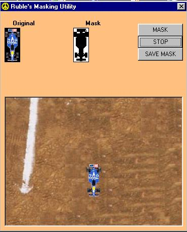



## Masking Utility

### Description

This is my first submission. This program takes a picture and makes a

mask image of it providing the mask color is black. After the mask is

created you can test your mask on the spot and save the mask for future

use. This code has examples of get/set pixel, BitBlt API functions. It

also has an example of how to use the CommonDialog control.

Read the nfo in the module and form declaration section

I have also provided some sample images to show how they are to be done.

Please feel free to leave me your comments, suggestions, and bugs.
 
### More Info
 

             |
---                |---
**Submitted On**   |2001-06-07 20:24:58
**By**             |[Ruble](https://github.com/Planet-Source-Code/PSCIndex/blob/master/ByAuthor/ruble.md)
**Level**          |Beginner
**User Rating**    |5.0 (15 globes from 3 users)
**Compatibility**  |VB 6\.0
**Category**       |[Complete Applications](https://github.com/Planet-Source-Code/PSCIndex/blob/master/ByCategory/complete-applications__1-27.md)
**World**          |[Visual Basic](https://github.com/Planet-Source-Code/PSCIndex/blob/master/ByWorld/visual-basic.md)
**Archive File**   |[Masking Ut20780672001\.zip](https://github.com/Planet-Source-Code/ruble-masking-utility__1-23871/archive/master.zip)

